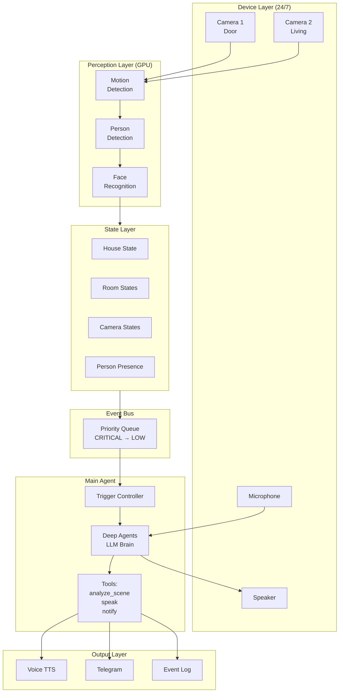

# Vision Assistant - Project Context for Claude

> **Last Updated:** 2026-02-07
> **Status:** Phase 1 Implementation Ready

---

## Quick Status

```
┌────────────────────────────────────────────────────────────────┐
│                    VISION ASSISTANT                             │
├────────────────────────────────────────────────────────────────┤
│  v2 (Complete)  │  v3 (In Progress)                            │
│  ✅ Face Recog   │  🔄 Phase 1: Foundation                      │
│  ✅ Person Det   │  ⏳ Phase 2: Vision Intelligence             │
│  ✅ Tracking     │  ⏳ Phase 3: Multi-Camera                    │
│  ✅ Tagging      │  ⏳ Phase 4: Conversation                    │
│  ✅ Voice TTS    │  ⏳ Phase 5: Telegram Bot                    │
└────────────────────────────────────────────────────────────────┘
```

---

## Session Completion Log

### 2026-02-07: Architecture & Planning Session

| Task | Status | Output |
|------|--------|--------|
| Architecture document | ✅ Done | `ARCHITECTURE.md` v3.0 |
| Research document | ✅ Done | `RESEARCH.md` |
| README updated | ✅ Done | Added architecture links |
| GitHub push | ✅ Done | 3 commits pushed |
| Issues created | ✅ Done | 8 issues (#1-#8) |
| Project CLAUDE.md | ✅ Done | This file |
| Project TRACKER.md | ✅ Done | Sprint tracking |
| Main CLAUDE.md | ✅ Done | Added Active Projects section |

**What was built:**
- Complete system architecture with mermaid diagrams
- Database schema (15+ tables)
- Event-driven architecture design
- Agent architecture with Deep Agents
- Deployment architecture with Docker Compose

**Next session:** Start Phase 1 implementation (Issues #1-#5)

---

## Project Overview

**Vision Assistant** is a complete Home AI system for smart security and family recognition.

### What's Built (v2 - Complete)
- Face recognition with auto-learning (82%+ accuracy)
- Person detection (YOLOv8n) + tracking
- Visit logging + tagging system (family/friends/public + roles)
- Voice greetings (TTS)
- VisionDB with persons, embeddings, visits tables

### What's Next (v3 - In Progress)
- Multi-camera support with unified state
- GPT-4o Vision for scene understanding
- Main Agent (Deep Agents) with tools
- Telegram bot for notifications + HITL
- House state management

---

## Architecture Overview



**See:** [ARCHITECTURE.md](ARCHITECTURE.md) for complete system design.

---

## Document Registry

| File | Purpose | Status |
|------|---------|--------|
| `ARCHITECTURE.md` | Complete system architecture v3.0 | ✅ Current |
| `RESEARCH.md` | Best practices research | ✅ Current |
| `TRACKER.md` | Sprint tracking and progress | ✅ Current |
| `ISSUES.md` | GitHub issues documentation | ✅ Current |
| `README.md` | Project overview + quick start | ✅ Current |
| `requirements.txt` | Python dependencies | ✅ Current |

---

## GitHub Issues

### Phase 1: Foundation (Current Sprint)
| Issue | Task | Status |
|-------|------|--------|
| [#1](https://github.com/KlementMultiverse/vision-assistant/issues/1) | Device Registry + Camera State | TODO |
| [#2](https://github.com/KlementMultiverse/vision-assistant/issues/2) | State Store with Pub/Sub | TODO |
| [#3](https://github.com/KlementMultiverse/vision-assistant/issues/3) | Event Bus | TODO |
| [#4](https://github.com/KlementMultiverse/vision-assistant/issues/4) | Database Migration | TODO |
| [#5](https://github.com/KlementMultiverse/vision-assistant/issues/5) | Pipeline Refactor | TODO |

### Phase 2: Vision Intelligence
| Issue | Task | Status |
|-------|------|--------|
| [#6](https://github.com/KlementMultiverse/vision-assistant/issues/6) | Vision Client (GPT-4o) | TODO |
| [#7](https://github.com/KlementMultiverse/vision-assistant/issues/7) | Trigger Controller | TODO |
| [#8](https://github.com/KlementMultiverse/vision-assistant/issues/8) | Main Agent (Deep Agents) | TODO |

---

## Code Structure

```
src/v2/
├── core/                    # NEW - Core abstractions
│   ├── devices.py           # Device, CameraState models
│   ├── state.py             # HouseState, PersonPresence
│   └── events.py            # EventBus, Event types
│
├── perception/              # EXISTING - Detection modules
│   ├── motion/              # Motion detection
│   ├── person/              # Person detection (YOLO)
│   └── face/                # Face detection (InsightFace)
│
├── storage/                 # EXISTING - Database layer
│   └── schema.py            # VisionDB (extending)
│
├── agent/                   # NEW - LLM agent
│   ├── main.py              # MainAgent (Deep Agents)
│   ├── tools.py             # analyze_scene, speak, notify
│   └── trigger.py           # TriggerController
│
├── vision/                  # NEW - Vision API
│   ├── client.py            # GPT-4o client
│   └── schemas.py           # VisionResult, PersonDescription
│
└── live_pipeline.py         # EXISTING - Main pipeline (refactoring)
```

---

## Key Design Decisions

| Decision | Why | How |
|----------|-----|-----|
| Event-Driven | Decouple perception from actions | Priority queue (CRITICAL=0 → LOW=100) |
| Devices as Entities | Multi-camera support | Device registry with status, heartbeat |
| State Hierarchy | Know who's where | House → Room → Camera → Person |
| GPT-4o Vision | Scene understanding | Structured output, dynamic prompts |
| Inside vs Outside | Different response needs | Outside=fast/paid, Inside=relaxed/free |

---

## Credentials

**Location:** `~/.claude/.env`

Contains:
- `GITHUB_TOKEN` - For git push and gh CLI
- `OPENAI_API_KEY` - For GPT-4o Vision
- `TELEGRAM_BOT_TOKEN` - For notifications (future)

---

## Running the System

### Current (v2)
```bash
source venv/bin/activate
python -m src.v2.live_pipeline
```

### Future (v3)
```bash
docker compose up -d
```

---

## Best Practices

1. **Type hints everywhere** - All dataclasses, all functions
2. **Immutable where possible** - `@dataclass(frozen=True)`
3. **Events, not callbacks** - Publish events, subscribe handlers
4. **Structured output** - Pydantic models for API responses
5. **Existing code first** - Extend VisionDB, don't replace

---

## Open Source References

- [Frigate NVR](https://github.com/blakeblackshear/frigate) - Detection pipeline, event lifecycle
- [Double Take](https://github.com/jakowenko/double-take) - Face recognition on events
- [InsightFace](https://github.com/deepinsight/insightface) - Face detection + embeddings
- [Deep Agents](https://github.com/langchain-ai/deepagents) - LLM agent framework

---

*This file helps Claude understand the project context across sessions.*
