# Vision Assistant 👁️

> **First open-source Vision + Learning + Acting agent for home use**

Real-time face recognition system that learns and improves over time. Designed for smart home applications - doorbell cameras, security, family recognition.

[](https://www.python.org/downloads/)
[](https://opensource.org/licenses/MIT)
[](https://developer.nvidia.com/cuda-toolkit)

---

## ✨ Features

- **Real-time Face Recognition** - 82%+ accuracy at 1-2 meter distance
- **Auto-Learning** - Automatically improves as it sees you in different conditions
- **Multi-Condition Support** - Works across lighting changes (day/night)
- **Visit Tracking** - Logs who visited, when, and for how long
- **Flexible Tagging** - Groups (family/friends/public) + Roles (daughter, delivery_guy, etc.)
- **Voice Greetings** - Speaks personalized greetings
- **Agent-Ready** - Designed to integrate with AI agents (Telegram, etc.)

---

## 🏗️ Architecture

### Current: v2 Pipeline

```mermaid
flowchart TB
    subgraph Input
        CAM[📷 Camera]
    end

    subgraph Perception
        MD[Motion Detection]
        PD[Person Detection<br/>YOLOv8n]
        FD[Face Detection<br/>InsightFace]
        EMB[Embedding<br/>512-D Vector]
    end

    subgraph Storage
        DB[(VisionDB<br/>SQLite)]
        PERSONS[Persons]
        EMBEDDINGS[Embeddings]
        VISITS[Visits]
    end

    subgraph Intelligence
        MATCH[Matching<br/>Cosine Similarity]
        LEARN[Auto-Learn<br/>New Conditions]
        DECIDE[Decision<br/>Known/Unknown]
    end

    subgraph Output
        VOICE[🔊 Voice]
        DISPLAY[🖥️ Display]
        AGENT[🤖 Agent API]
    end

    CAM --> MD --> PD --> FD --> EMB
    EMB --> MATCH
    DB --> MATCH
    MATCH --> DECIDE
    DECIDE --> LEARN --> DB
    DECIDE --> VOICE
    DECIDE --> DISPLAY
    DECIDE --> AGENT

    DB --- PERSONS
    DB --- EMBEDDINGS
    DB --- VISITS
```



### Coming: v3 Full Home AI

```mermaid
flowchart TB
    subgraph Devices["🏠 Device Layer"]
        CAM1[📷 Door Camera]
        CAM2[📷 Living Room]
        CAM3[📷 Kitchen]
        MIC[🎤 Microphone]
        SPK[🔊 Speaker]
    end

    subgraph Perception["⚡ Perception Layer"]
        MOT[Motion<br/>Detection]
        PER[Person<br/>Detection]
        FAC[Face<br/>Recognition]
        TRK[Object<br/>Tracker]
    end

    subgraph State["💾 State Layer"]
        HS[🏠 House State]
        RS[📍 Room States]
        PP[👤 Person Presence]
    end

    subgraph Events["📨 Event Bus"]
        EB[Priority Queue<br/>🔴 CRITICAL<br/>🟠 HIGH<br/>🟡 NORMAL<br/>🟢 LOW]
    end

    subgraph Agent["🧠 Main Agent"]
        TC[Trigger<br/>Controller]
        DA[Deep Agents<br/>LLM Brain]
        VIS[🔍 GPT-4o<br/>Vision]
    end

    subgraph Tools["🛠️ Agent Tools"]
        T1[analyze_scene]
        T2[speak]
        T3[notify_owner]
        T4[get_state]
    end

    subgraph Output["📤 Output Layer"]
        TTS[🔊 Voice TTS]
        TG[📱 Telegram]
        LOG[📝 Event Log]
    end

    CAM1 --> MOT
    CAM2 --> MOT
    CAM3 --> MOT
    MOT --> PER --> FAC --> TRK
    TRK --> State
    State --> EB
    EB --> TC --> DA
    DA --> VIS
    DA --> Tools
    T1 --> VIS
    T2 --> TTS
    T3 --> TG
    T4 --> State
    MIC --> DA
    DA --> SPK
```



> **See:** [ARCHITECTURE.md](ARCHITECTURE.md) for complete system design with code examples.

---

## 📊 Data Flow


---

## 🗄️ Database Schema

### Current: v2 Schema


### Coming: v3 Extended Schema


---

## 🚀 Quick Start

### Prerequisites

- Python 3.10+
- NVIDIA GPU with CUDA 12.x (recommended)
- Webcam or IP camera

### Installation

```bash
# Clone the repository
git clone https://github.com/yourusername/vision-assistant.git
cd vision-assistant

# Create virtual environment
python -m venv venv
source venv/bin/activate  # Linux/Mac
# or: venv\Scripts\activate  # Windows

# Install dependencies
pip install -r requirements.txt
```

### Download Models

Models are downloaded automatically on first run:

| Model | Size | Purpose |
|-------|------|---------|
| InsightFace buffalo_l | ~600MB | Face detection + embedding |
| YOLOv8n | ~6MB | Person detection |

### Run

```bash
# Live pipeline with recognition + tagging
python -m src.v2.live_pipeline

# Calibrate threshold for your face
python calibrate_face.py

# Test recognition accuracy
python recognize_only.py
```

---

## 📁 Project Structure

```
vision-assistant/
├── src/
│   └── v2/
│       ├── perception/           # Detection modules
│       │   ├── motion/           # Motion detection
│       │   ├── person/           # Person detection (YOLO)
│       │   └── face/             # Face detection (InsightFace)
│       │
│       ├── storage/              # Database layer
│       │   ├── schema.py         # VisionDB - full schema
│       │   └── face_db.py        # Simple face DB
│       │
│       ├── intelligence/         # State machine
│       │   └── state.py          # Presence tracking
│       │
│       ├── understanding/        # Voice output
│       │   └── voice.py          # TTS
│       │
│       ├── live_pipeline.py      # Fast recognition + tagging
│       └── smart_pipeline.py     # Full pipeline with auto-learn
│
├── docs/
│   ├── ARCHITECTURE.md           # Complete system architecture
│   └── RESEARCH.md               # Best practices research
│
├── calibrate_face.py             # Threshold calibration
├── collect_data.py               # Data collection tool
├── recognize_only.py             # Recognition test
├── requirements.txt              # Dependencies
├── ARCHITECTURE.md               # System architecture (main)
├── RESEARCH.md                   # Research & best practices
└── README.md
```

> **New to the project?** Start with [ARCHITECTURE.md](ARCHITECTURE.md) for the complete system design.

---

## ⚙️ Configuration

### Recognition Threshold

The threshold determines how similar a face must be to match:

| Threshold | Behavior |
|-----------|----------|
| 0.20 | Very lenient - may false positive |
| **0.25** | **Recommended** - balanced |
| 0.35 | Strict - may miss in bad lighting |

Calibrate for your conditions:
```bash
python calibrate_face.py
```

### Auto-Learning

The system automatically adds new embeddings when:
- Person is recognized
- Current embedding differs from stored (>30% different)
- Detection confidence is good (>50%)
- Not already learned this visit

This improves recognition across:
- Different lighting (day/night)
- Different angles
- Different distances

---

## 🏷️ Tagging System

### Groups

| Group | Purpose | Greeting |
|-------|---------|----------|
| `family` | Household members | "Welcome home, [Name]!" |
| `friends` | Known visitors | "Hello, [Name]!" |
| `public` | Everyone else | "Hello!" |

### Roles (Optional)

Examples: `daughter`, `son`, `spouse`, `delivery_guy`, `postman`, `school_friend`, `work_colleague`

### Tagging via UI

1. Face appears → Shows as `unknown_N`
2. Press `t` to tag
3. Enter name → Select group → Enter role (optional)
4. Saved! Next time recognized by name.

---

## 📈 Performance

Tested on RTX 4060 (8GB VRAM):

| Metric | Value |
|--------|-------|
| FPS | 25-30 |
| Recognition accuracy | 82%+ |
| Face detection | 89% of frames |
| VRAM usage | ~1.5GB |

---

## 🔒 Privacy

- **All processing is local** - no cloud APIs
- **Database is local** - your face data never leaves your machine
- **No telemetry** - zero data collection
- **.gitignore** - prevents accidental commits of personal data

---

## 🛠️ Hardware Requirements

### Minimum
- CPU: Any modern quad-core
- RAM: 8GB
- GPU: NVIDIA GTX 1060 or equivalent
- Camera: 720p webcam

### Recommended
- CPU: Intel i5/AMD Ryzen 5 or better
- RAM: 16GB
- GPU: NVIDIA RTX 3060+ (8GB VRAM)
- Camera: 1080p webcam or IP camera

---

## 🔮 Roadmap

### Phase 1: Smart Vision (Current)
- [x] Face recognition with auto-learning
- [x] Person detection + tracking
- [x] Visit logging + tagging system
- [ ] GPT Vision for scene understanding
- [ ] Smart pipeline (when to look, reasoning)

### Phase 2: Multi-Camera Intelligence
- [ ] Multi-camera support (unified view)
- [ ] Multi-person tracking (no duplicates)
- [ ] Cross-camera person linking
- [ ] Zone detection (entry/exit triggers)
- [ ] Context-aware greetings (family + unknown = cautious)

### Phase 3: House Bot
- [ ] Telegram bot integration
- [ ] Rules engine + HITL decisions
- [ ] House-wide awareness (all cameras linked)
- [ ] Safety monitoring (main goal)
- [ ] Event notifications + actions

### Phase 4: Personal Assistants
- [ ] Individual agents per family member
- [ ] Permission system (house bot > personal agents)
- [ ] Personal preferences + routines
- [ ] Attach to house agent

### Phase 5: Full Home AI
- [ ] Account management (groceries, cabs, etc.)
- [ ] Device + robot control
- [ ] Inside + outside tracking
- [ ] Learning + improvement over time
- [ ] House email management
- [ ] Cloud or on-premise deployment

### Future
- [ ] Raspberry Pi support
- [ ] Voice assistant integration
- [ ] Smart home ecosystem (Home Assistant, MQTT)

---

## 🤝 Contributing

Contributions welcome! Please read the contributing guidelines first.

1. Fork the repository
2. Create your feature branch (`git checkout -b feature/amazing-feature`)
3. Commit your changes (`git commit -m 'Add amazing feature'`)
4. Push to the branch (`git push origin feature/amazing-feature`)
5. Open a Pull Request

---

## 📄 License

MIT License - see [LICENSE](LICENSE) for details.

---

## 🙏 Acknowledgments

- [InsightFace](https://github.com/deepinsight/insightface) - Face detection and recognition
- [Ultralytics YOLOv8](https://github.com/ultralytics/ultralytics) - Person detection
- [OpenCV](https://opencv.org/) - Computer vision
- [Frigate NVR](https://github.com/blakeblackshear/frigate) - Architecture inspiration

---

<p align="center">
  <b>Built with ❤️ for the open-source community</b>
</p>
