# Vision Assistant

> **First open-source Vision + Learning + Acting agent for home use**

Real-time face recognition system that learns and improves over time. Designed for smart home applications - doorbell cameras, security, family recognition.

[](https://www.python.org/downloads/)
[](https://opensource.org/licenses/MIT)
[](https://developer.nvidia.com/cuda-toolkit)

---

## Features

- **Real-time Face Recognition** - 82%+ accuracy at 1-2 meter distance
- **Auto-Learning** - Automatically improves as it sees you in different conditions
- **Multi-Camera Support** - Unified tracking across cameras
- **Scene Understanding** - GPT-4o Vision for context awareness
- **Visit Tracking** - Logs who visited, when, and for how long
- **Flexible Tagging** - Groups (family/friends/public) + Roles (daughter, delivery_guy, etc.)
- **Voice Greetings** - Speaks personalized greetings
- **Agent-Ready** - Deep Agents framework for intelligent decisions

---

## Architecture

### System Overview

```mermaid
flowchart TB
    subgraph Devices["📷 Device Layer (24/7)"]
        CAM1[Camera<br/>Door]
        CAM2[Camera<br/>Living]
        MIC[Microphone]
        SPK[Speaker]
    end

    subgraph Perception["🔍 Perception Layer (GPU)"]
        MOT[Motion<br/>OpenCV]
        PER[Person<br/>YOLOv8n]
        FAC[Face<br/>InsightFace]
        EMB[Embedding<br/>512-D]
    end

    subgraph State["📊 State + Events"]
        HS[House State]
        PS[Person Presence]
        EB[Event Bus<br/>Priority Queue]
    end

    subgraph Agent["🤖 Main Agent (Deep Agents)"]
        TC[Trigger Controller]
        MA[LLM Brain]
        TOOLS[Tools]
    end

    subgraph Output["📢 Output Layer"]
        TTS[Voice TTS]
        TG[Telegram]
        LOG[Event Log]
    end

    CAM1 & CAM2 --> MOT --> PER --> FAC --> EMB
    EMB --> HS & PS
    HS & PS --> EB --> TC --> MA --> TOOLS
    MIC --> MA
    TOOLS --> TTS & TG & LOG
    MA --> SPK
```



### Perception Pipeline


### Event Priority System

```mermaid
flowchart LR
    subgraph Events["Events by Priority"]
        C[🔴 CRITICAL<br/>Unknown at door]
        H[🟠 HIGH<br/>Person arrived]
        N[🟡 NORMAL<br/>Motion detected]
        L[🟢 LOW<br/>Heartbeat/logs]
    end

    subgraph Response
        I[Immediate<br/>GPT-4o]
        D[Delayed<br/>Batch]
        S[State Update<br/>No LLM]
    end

    C --> I
    H --> I
    N --> D
    L --> S
```



> **See:** [ARCHITECTURE.md](ARCHITECTURE.md) for complete system design with code examples, database schema, and deployment configuration.

### Deployment Architecture


---

## Quick Start

### Prerequisites

- Python 3.10+
- NVIDIA GPU with CUDA 12.x (recommended)
- Webcam or IP camera

### Installation

```bash
# Clone the repository
git clone https://github.com/KlementMultiverse/vision-assistant.git
cd vision-assistant

# Create virtual environment
python -m venv venv
source venv/bin/activate  # Linux/Mac

# Install dependencies
pip install -r requirements.txt
```

### Run

```bash
# Live pipeline with recognition + tagging
python -m src.v2.live_pipeline

# Calibrate threshold for your face
python calibrate_face.py

# Test recognition accuracy
python recognize_only.py
```

---

## Database Schema


---

## Configuration

### Recognition Threshold

| Threshold | Behavior |
|-----------|----------|
| 0.20 | Very lenient - may false positive |
| **0.25** | **Recommended** - balanced |
| 0.35 | Strict - may miss in bad lighting |

### Tagging System

| Group | Purpose | Greeting |
|-------|---------|----------|
| `family` | Household members | "Welcome home, [Name]!" |
| `friends` | Known visitors | "Hello, [Name]!" |
| `public` | Everyone else | "Hello!" |

---

## Performance

Tested on RTX 4060 (8GB VRAM):

| Metric | Value |
|--------|-------|
| FPS | 25-30 |
| Recognition accuracy | 82%+ |
| Face detection | 89% of frames |
| VRAM usage | ~1.5GB |

---

## Hardware Requirements

### Minimum
- CPU: Any modern quad-core
- RAM: 8GB
- GPU: NVIDIA GTX 1060 or equivalent
- Camera: 720p webcam

### Recommended
- CPU: Intel i5/AMD Ryzen 5 or better
- RAM: 16GB
- GPU: NVIDIA RTX 3060+ (8GB VRAM)
- Camera: 1080p webcam or IP camera

---

## Privacy

- **All processing is local** - no cloud APIs for face recognition
- **Database is local** - your face data never leaves your machine
- **No telemetry** - zero data collection
- **.gitignore** - prevents accidental commits of personal data

---

## Roadmap

| Phase | Status | Focus |
|-------|--------|-------|
| Foundation | In Progress | Devices, State, Events, Database |
| Vision Intelligence | Planned | GPT-4o, Trigger Controller, Agent |
| Multi-Camera | Planned | Cross-camera tracking, zones |
| Conversation | Planned | STT, TTS, dialogue |
| Telegram Bot | Planned | Notifications, HITL |

> **See:** [TRACKER.md](TRACKER.md) for detailed progress tracking.

---

## Project Structure

```
vision-assistant/
├── src/v2/
│   ├── core/               # Devices, State, Events
│   ├── perception/         # Detection modules
│   │   ├── motion/         # Motion detection
│   │   ├── person/         # Person detection (YOLO)
│   │   └── face/           # Face detection (InsightFace)
│   ├── storage/            # Database layer
│   ├── agent/              # LLM agent (Deep Agents)
│   ├── vision/             # GPT-4o Vision client
│   └── live_pipeline.py    # Main pipeline
├── ARCHITECTURE.md         # Complete system design
├── TRACKER.md              # Sprint tracking
└── README.md
```

---

## Contributing

Contributions welcome! Please read the contributing guidelines first.

1. Fork the repository
2. Create your feature branch (`git checkout -b feature/amazing-feature`)
3. Commit your changes (`git commit -m 'Add amazing feature'`)
4. Push to the branch (`git push origin feature/amazing-feature`)
5. Open a Pull Request

---

## License

MIT License - see [LICENSE](LICENSE) for details.

---

## Acknowledgments

- [InsightFace](https://github.com/deepinsight/insightface) - Face detection and recognition
- [Ultralytics YOLOv8](https://github.com/ultralytics/ultralytics) - Person detection
- [Frigate NVR](https://github.com/blakeblackshear/frigate) - Architecture inspiration
- [Deep Agents](https://github.com/langchain-ai/deepagents) - LLM agent framework

---

<p align="center">
  <b>Built for the open-source community</b>
</p>
